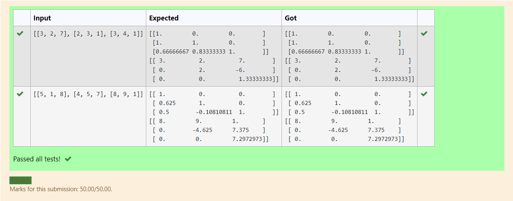
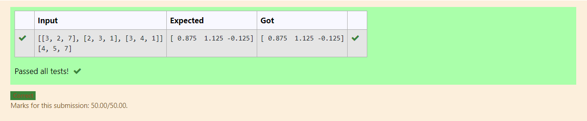

# LU Decomposition without zero on the diagonal

## AIM:
To write a program to find the LU Decomposition of a matrix.

## Equipments Required:
1. Hardware – PCs
2. Anaconda – Python 3.7 Installation / Moodle-Code Runner

## Algorithm
1. Start the program.
2. import numpy,import sys.
3. Use gaussian solving methods.
4. Display the values.
5. End the program.

## Program:
```
/*
'''Program to find L and U matrix using LU decomposition.
Developed by: Kirupanandhan.T
RegisterNumber: 21001418
'''

# To print L and U matrix
import numpy as np
from scipy.linalg import lu
A=np.array(eval(input()))
P,L,U=lu(A)
print(L)
print(U)
*/
```

## Output:



## Result:
Thus the program to find the LU Decomposition of a matrix is written and verified using python programming.

# LU Decomposition without zero on the diagonal

## AIM:
To write a program to Use LU Decomposition to solve a matrix..

## Equipments Required:
1. Hardware – PCs
2. Anaconda – Python 3.7 Installation / Moodle-Code Runner

## Algorithm
1. import numpy as np
2. From scipy package import lu_factor,lu_solve
3. Get input from user
4. Display the values.
5. End the program.
## Program:
```
/*
'''Program to solve a matrix using Gaussian elimination with partial pivoting.
Developed by: Kirupanandhan.T
RegisterNumber: 21001418
'''
import numpy as np
import sys
n=int(input())
a=np.zeros((n,n+1))
x=np.zeros(n)
for i in range(n):
    for j in range(n+1):
        a[i][j]=float(input())
for i in range(n):
    if a[i][i]==0.0:
        sys.exit('divide by zero detected!')
    for j in range(i+1,n):
        ratio=a[j][i]/a[i][i]
        for k in range(n+1):
            a[j][k]=a[j][k]-ratio*a[i][k]
#Back Substitution
x[n-1]=a[n-1][n]/a[n-1][n-1]
for i in  range(n-2,-1,-1):
    x[i]=a[i][n]
    for j in range(i+1,n):
        x[i]=x[i]-a[i][j]*x[j]
    x[i]=x[i]/a[i][i]
# Displaying solution
for i in range(n):
     print("X%d = %0.2f " %(i,x[i]),end = '')
*/
```

## Output:



## Result:
Thus the program to find the LU Decomposition of a matrix is written and verified using python programming.


